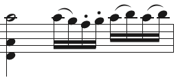

---
---
In most cases the `<duration>` will be the same as the preceding note. However it can be shorter in situations such as multiple stops for string instruments. Here is an example from Mozart's Concerto No. 3 for Violin, K. 216:

If these first three notes are represented as a chord, the quarter notes must be the ones with the `<chord>` element.
