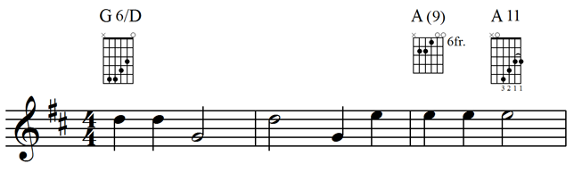

Much contemporary sheet music makes use of chord symbols and chord diagrams. These notations of musical harmony are found in such different types of sheet music as lead sheets, piano / vocal / guitar arrangements, worship music, and jazz big-band charts.

MusicXML’s [`<harmony>`](../../musicxml-reference/elements/harmony/) element provides a rich description of both harmonic content and the appearance of chord symbols and diagrams. It can be used both for functional harmony analysis as well as chord symbols. Chord symbols and diagrams are the most common use, and that is what we focus on here.

## Chord Symbols

Here is a [three-bar example](../../musicxml-reference/examples/tutorial-chord-symbols/) of a simple lead sheet. It contains the melody together with chord symbols and diagrams for how to play the chords on a guitar:



The first chord is a G major sixth chord with the fifth (D) in the bass. The second chord is notated as an A major chord with an added ninth degree. Another analysis might be to call it a dominant ninth chord with a missing seventh degree. MusicXML supports both types of analysis. For this example, we follow the written chord diagram notation. The third chord, an A11, will be discussed in the chord diagram section, as it includes both fingerings and a barre symbol.

Here is how the first G6 chord symbol is represented in the MusicXML file, omitting the chord diagram for the time being:

```xml
<harmony default-y="100">
	<root>
		<root-step>G</root-step>
	</root>
	<kind halign="center" text="6">major-sixth</kind>
	<bass>
		<bass-step>D</bass-step>
	</bass>
</harmony>
```

Each chord symbol has at least two elements: a [`<root>`](../../musicxml-reference/elements/root/) element to indicate the root of the chord, and a [`<kind>`](../../musicxml-reference/elements/kind/) element to indicate the type of the chord. Here, we have a root of G and a kind of major-sixth. MusicXML 4.0 supports [33 different `<kind>` element values](../../musicxml-reference/data-types/kind-value/). The kind element has a text attribute that indicates that the chord is displayed as G6, not as Gmaj6, GM6, or other spelling that could represent the same chord. This symbol also indicates the bass of the chord, represented using the [`<bass>`](../../musicxml-reference/elements/bass/) element.

Both the `<root>` and the `<bass>` elements divide the pitch into step and alter elements, similar to how the `<pitch>` element works. The `<root>` element uses the [<root-step>](../../musicxml-reference/elements/root-step/) and [<root-alter>](../../musicxml-reference/elements/root-alter/) elements, while the bass element uses the [`<bass-step>`](../../musicxml-reference/elements/bass-step/) and [`<bass-alter>`](../../musicxml-reference/elements/bass-alter/) elements. There is no element that corresponds to the octave element for pitch, since this information is not considered part of the harmonic analysis or the chord symbol.

MusicXML can represent all sorts of alterations to the built-in 33 kinds of chords. Degrees in the chord can be added, subtracted (e.g. “no 3”), or altered (e.g. “#5”). Here is how the second A(9) chord symbol is presented in MusicXML, using an added degree:

```xml
<harmony default-y="100">
	<root>
		<root-step>A</root-step>
	</root>
	<kind halign="center" parentheses-degrees="yes">major</kind>
	<degree>
		<degree-value>9</degree-value>
		<degree-alter>0</degree-alter>
		<degree-type text="">add</degree-type>
	</degree>
</harmony>
```

The [`<degree>`](../../musicxml-reference/elements/degree/) element shows that we are adding an unaltered 9th degree to the chord, notating it with just the degree value (not as “add 9”) and with the added degrees in parentheses. The value of the [`<degree-type>`](../../musicxml-reference/elements/degree-type/) element can be add, alter, or subtract. If the `<degree-type>` value is alter or subtract, the [`<degree-alter>`](../../musicxml-reference/elements/degree-alter/) value is relative to the degree already in the chord based on its kind element. If the `<degree-type>` value is add, the `<degree-alter>` value is relative to a dominant chord.

MusicXML’s `<harmony>` element contains additional features to support formatting and harmonic analysis. Full details are available in the reference documentation.

## Chord Diagrams

Chord diagrams, also known as chord frames, are used to indicate how a chord is played on a fretted instrument such as the guitar. The vertical lines in the chord diagrams represent strings, while the horizontal spaces represent frets. An x above a string indicates that the string is muted, while an o above a string represents an open string.

MusicXML uses the [`<frame>`](../../musicxml-reference/elements/frame/) element to represent chord diagrams. Let us look at the `<harmony>` element for the first G6 chord again, this time including the `<frame>` element for the chord diagram:

```xml
<harmony default-y="100">
	<root>
		<root-step>G</root-step>
	</root>
	<kind halign="center" text="6">major-sixth</kind>
	<bass>
		<bass-step>D</bass-step>
	</bass>
	<frame default-y="83" halign="center" relative-x="5" valign="top">
		<frame-strings>6</frame-strings>
		<frame-frets>5</frame-frets>
		<frame-note>
			<string>5</string>
			<fret>5</fret>
		</frame-note>
		<frame-note>
			<string>4</string>
			<fret>5</fret>
		</frame-note>
		<frame-note>
			<string>3</string>
			<fret>4</fret>
		</frame-note>
		<frame-note>
			<string>2</string>
			<fret>3</fret>
		</frame-note>
		<frame-note>
			<string>1</string>
			<fret>0</fret>
		</frame-note>
	</frame>
</harmony>
```

The `<frame>` element starts with [`<frame-strings>`](../../musicxml-reference/elements/frame-strings/) and [`<frame-frets>`](../../musicxml-reference/elements/frame-frets/) elements to indicate the size of the frame. Each string that is played is then represented with a [<frame-note>](../../musicxml-reference/elements/frame-note/) element. The lowest string, string 6, is muted in this diagram, so it has no corresponding `<frame-note>` element. The highest string, string 1, is open, so its fret value is set to 0.

The positioning attributes indicate the vertical position of both the chord symbol text in the `<harmony>` element and the chord diagram in the `<frame>` element. The valign attribute of the frame element indicates that the default-y position represents the top of the chord diagram. The halign attributes indicate that both the chord symbol text and chord diagram are center-aligned.

In the second chord diagram, the first fret we see in the diagram corresponds to the sixth fret on the guitar. This is represented in MusicXML by the [`<first-fret>`](../../musicxml-reference/elements/first-fret/) element. Unlike the other diagrams, this one shows only four frets. Here is the `<frame>` element for the second chord diagram:

```xml
<frame default-y="83" halign="center" valign="top">
	<frame-strings>6</frame-strings>
	<frame-frets>4</frame-frets>
	<first-fret location="right" text="6fr.">6</first-fret>
	<frame-note>
		<string>5</string>
		<fret>7</fret>
	</frame-note>
	<frame-note>
		<string>4</string>
		<fret>7</fret>
	</frame-note>
	<frame-note>
		<string>3</string>
		<fret>6</fret>
	</frame-note>
	<frame-note>
		<string>2</string>
		<fret>5</fret>
	</frame-note>
	<frame-note>
		<string>1</string>
		<fret>5</fret>
	</frame-note>
</frame>
```

The text attribute of the `<first-fret>` element shows how the text is displayed, and the location attribute indicates where it is displayed: to the right of the chord frame.

The third chord symbol adds fingerings and a barre indication. Here is the MusicXML `<harmony>` element for this symbol:

```xml
<harmony default-y="100">
	<root>
		<root-step>A</root-step>
	</root>
	<kind halign="center" text="11">dominant-11th</kind>
	<frame default-y="83" halign="center" valign="top">
		<frame-strings>6</frame-strings>
		<frame-frets>5</frame-frets>
		<frame-note>
			<string>5</string>
			<fret>0</fret>
		</frame-note>
		<frame-note>
			<string>4</string>
			<fret>6</fret>
			<fingering>3</fingering>
		</frame-note>
		<frame-note>
			<string>3</string>
			<fret>4</fret>
			<fingering>2</fingering>
		</frame-note>
		<frame-note>
			<string>2</string>
			<fret>3</fret>
			<fingering>1</fingering>
			<barre type="start"/>
		</frame-note>
		<frame-note>
			<string>1</string>
			<fret>3</fret>
			<fingering>1</fingering>
			<barre type="stop"/>
		</frame-note>
	</frame>
</harmony>
```

The [`<fingering>`](../../musicxml-reference/elements/fingering/) element is used to indicate the fingering for each string in the diagram that is neither muted nor open. The [`<barre>`](../../musicxml-reference/elements/barre/) element is used to indicate where a barre symbol starts and stops within the frame. The type is start for the lowest-pitched string and stop for the highest-pitched string. This corresponds to the left-to-right order from low to high strings that is used in chord diagrams.

Next: [Tablature](../tablature/)