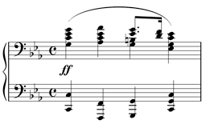

MusicXML consists of two main types of elements. One set of elements is used to represent how a piece of music is notated. These elements are used for displaying sheet music on screen or in print. The other set of elements are used to represent a sonic realization of the score, and are commonly used for MIDI playback.

We encourage programs writing MusicXML to write as much accurate data as they can. The only elements that are required, though, are the sounding elements that relate directly to creating a MIDI file from MusicXML. This is where we will start in introducing the musical elements of a MusicXML file.

As an [example](../../musicxml-reference/examples/tutorial-apres-un-reve/), we will use the first four bars of "Après un rêve" by Gabriel Fauré:


## Attributes

The [`<attributes>`](../../musicxml-reference/elements/attributes/) element contains information about time signatures, key signatures, transpositions, clefs, and other musical data that is usually specified at the beginning of a piece or at the start of a measure. We discuss the MIDI-compatible elements here. Other elements like `<clef>` and `<staves>` are discussed later in this tutorial.

In this example, we have the following MIDI-compatible attributes:

```xml
<attributes>
	<divisions>24</divisions>
	<key>
		<fifths>-3</fifths>
		<mode>minor</mode>
	</key>
	<time>
		<beats>3</beats>
		<beat-type>4</beat-type>
	</time>
</attributes>
```

### Divisions

Musical durations are commonly referred to as fractions: whole notes, half notes, quarter notes, and the like. While each musical note could have a fraction associated with it, MusicXML instead follows MIDI by specifying the number of divisions per quarter note at the start of a musical part, and then specifying note durations in terms of these divisions.

MusicXML allows the [`<divisions>`](../../musicxml-reference/elements/divisions/) element value to change in the middle of a part. However for the broadest app compatibility, it is best to compute just one `<divisions>` value per part, placed at the beginning of the first measure. The divisions value of 24 in this example allows for both triplet eighth notes (being divisible by 3) and regular sixteenth notes (being divisible by 4).

### Key

Standard key signatures are represented like MIDI key signatures. The [`<fifths>`](../../musicxml-reference/elements/fifths/) element specifies the number of flats or sharps in the key signature - negative for flats, positive for sharps. The fifths name indicates that this value represents the key signature's position on the circle of fifths. MusicXML uses the [`<mode>`](../../musicxml-reference/elements/mode/) element to indicate major or minor key signatures.

### Time

Standard time signatures are represented more directly in MusicXML than in MIDI 1.0. The [`<beats>`](../../musicxml-reference/elements/beats/) element represents the time signature numerator, and the [`<beat-type>`](../../musicxml-reference/elements/beat-type/) element represents the time signature denominator. Many variations are possible, including composite and interchangeable time signatures.

### Transpose

If you are writing a part for a transposing instrument, the transposition must be specified in MusicXML in order for the sound output to be correct. The [`<transpose>`](../../musicxml-reference/elements/transpose/) element represents what must be added to the written pitch to get the correct sounding pitch.

The [`<chromatic>`](../../musicxml-reference/elements/chromatic/) element, representing the number of chromatic steps to add to the written pitch, is the one required element. The [`<diatonic>`](../../musicxml-reference/elements/diatonic/), [`<octave-change>`](../../musicxml-reference/elements/octave-change/), and [`<double>`](../../musicxml-reference/elements/double/) elements are optional elements.

Say we have a part written for a trumpet in B-flat. A written "C" on this part will sound as a B-flat on a piano. This transposition is one diatonic step down (C to B) and two chromatic half steps down (C to B to B-flat). In MusicXML it would be represented as:

```xml
<transpose>
	<diatonic>-1</diatonic>
	<chromatic>-2</chromatic>
</transpose>
```

The `<diatonic>` element is not needed for correct MIDI output, but it helps get transposition notation correct and programs are encouraged to use it wherever possible.

The `<octave-change>` element is used when transpositions exceed an octave in either direction. The `<double>` element is used when the part should be doubled an octave lower or higher, as when a single part is used for both cello and string bass, or for both flute and piccolo.

## Pitch

Pitch, duration, ties, and lyrics are all represented within the MusicXML [`<note>`](../../musicxml-reference/elements/note/) element. For example, the E-flat that starts bar 3 in the voice part has the following MIDI-compatible elements:

```xml
<note>
	<pitch>
		<step>E</step>
		<alter>-1</alter>
		<octave>5</octave>
	</pitch>
	<duration>24</duration>
	<tie type="start"/>
	<lyric>
		<syllabic>end</syllabic>
		<text>meil</text>
		<extend/>
	</lyric>
</note>
```

In MIDI, a pitch is represented by a single number. MusicXML divides pitch into three parts: the [`<step>`](../../musicxml-reference/elements/step/) element (A, B, C, D, E, F, or G), an optional [`<alter>`](../../musicxml-reference/elements/alter/) element (-1 for flat, 1 for sharp), and an [`<octave>`](../../musicxml-reference/elements/octave/) element (4 for the octave starting with middle C).

The [`<pitch>`](../../musicxml-reference/elements/pitch/) element requires an `<alter>` element, even if the accidental is already in the key signature. Although the `<alter>` element does not change how the pitch is notated, it ensures proper playback and transposition. This is why the E-flat contains an `<alter>` element, though there is no accidental on the note.

Alter values of -2 and 2 can be used for double-flat and double-sharp. Decimal values can be used for microtones (e.g., 0.5 for a quarter-tone sharp), but not all programs may convert this into MIDI pitch-bend data.

For rests, a [`<rest>`](../../musicxml-reference/elements/rest/) element is used instead of the pitch element. The whole rest in 3/4 that begins the voice part is represented as:

```xml
<note>
	<rest measure="yes"/>
	<duration>72</duration>
</note>
```

## Duration

The [`<duration>`](../../musicxml-reference/elements/duration/) element is an integer that represents a note's duration in terms of divisions per quarter note. Since our example has 24 divisions per quarter note, a quarter note has a duration of 24. The eighth-note triplets have a duration of 8, while the eighth notes have a duration of 12.

## Tied Notes

The sounding part of a tied note is indicated by the [`<tie>`](../../musicxml-reference/elements/tie/) element. The `<tie>` element has a type of start for the starting note of a tie, and a type of stop for the ending note in a tie. A `<note>` element can have two `<tie>` elements. If a note is tied to the notes both before and after it, place the tie to the previous note, `<tie type="stop">`, before the `<tie type="start">` to the next note.

## Chords

The `<duration>` elements in MusicXML move a musical counter. To play chords, we need to indicate that a note should start at the same time as the previous note, rather than following the previous note. To do this in MusicXML, add a [`<chord>`](../../musicxml-reference/elements/chord/) element to the note.

In our example, the piano part does not have rhythms more complex than eighth notes, so our converter sets the divisions value to 2. With 2 divisions per quarter note, the sound portion of the first chord in the piano part is represented as:

```xml
<note>
	<pitch>
		<step>C</step>
		<octave>4</octave>
	</pitch>
	<duration>1</duration>
</note>
<note>
	<chord/>
	<pitch>
		<step>E</step>
		<alter>-1</alter>
		<octave>4</octave>
	</pitch>
	<duration>1</duration>
</note>
<note>
	<chord/>
	<pitch>
		<step>G</step>
		<octave>4</octave>
	</pitch>
	<duration>1</duration>
</note>
```

Each note in the chord following the first one includes a `<chord>` element before the `<pitch>` element.

If you find that you have notes in a chord with different durations, you are probably better representing this as multi-part music rather than a chord. If you must have notes with different durations in the chord, the longest note must be the first note in the chord.

## Lyrics

While lyrics are not yet used in sound generation, they are included in Standard MIDI files, so we will discuss them here with the other MIDI-compatible features of MusicXML.

Lyrics in MusicXML use an optional [`<syllabic>`](../../musicxml-reference/elements/syllabic/) element to indicate how a syllable fits into a word, rather than having conventions based on hyphens and spaces as some other formats do. The values for syllabic can be "single", "begin", "end", or "middle". We saw earlier that the E-flat starting the third measure had a syllabic value of "end", since "meil" was the end of a two-syllable word. The "ma" syllable in "image" has a syllabic value of "middle". In the second measure, the notes are:

```xml
<note>
	<pitch>
		<step>G</step>
		<octave>4</octave>
	</pitch>
	<duration>24</duration>
	<lyric>
		<syllabic>single</syllabic>
		<text>Dans</text>
	</lyric>
</note>
<note>
	<pitch>
		<step>C</step>
		<octave>5</octave>
	</pitch>
	<duration>24</duration>
	<lyric>
		<syllabic>single</syllabic>
		<text>un</text>
	</lyric>
</note>
<note>
	<pitch>
		<step>D</step>
		<octave>5</octave>
	</pitch>
	<duration>24</duration>
	<lyric>
		<syllabic>begin</syllabic>
		<text>som</text>
	</lyric>
</note>
```

The actual text of the lyric is specified in the [`<text>`](../../musicxml-reference/elements/text/) element. A note may have multiple syllables, in which case the multiple `<syllabic>/<text>` element pairs should be separated by an [`<elision>`](../../musicxml-reference/elements/elision/) element. Word extensions may be indicated by using the [`<extend>`](../../musicxml-reference/elements/extend/) element, as in the “meil” syllable above.

Multiple verses are indicating using multiple [`<lyric>`](../../musicxml-reference/elements/lyric/) elements. The number and name attributes can be used to distinguish them: `<lyric number="1">` for the first verse, `<lyric number="2">` for the second.

MusicXML has [`<end-line>`](../../musicxml-reference/elements/end-line/) and [`<end-paragraph>`](../../musicxml-reference/elements/end-paragraph/) elements to support Standard MIDI File Lyric meta-events specified in RP-017. These are used for karaoke and similar applications. Elements for [`<humming>`](../../musicxml-reference/elements/humming/) and [`<laughing>`](../../musicxml-reference/elements/laughing/) may also be included, though they do not have MIDI equivalents. These lyric elements have not yet been implemented in MusicXML software.

## Multi-Part Music

While monophonic instruments like trumpet, flute, and voice move along one note at a time, instruments like the piano can have many musical lines at once. Take this simple [example](../../musicxml-reference/examples/tutorial-chopin-prelude/) from the first bar of Frederic Chopin's Prelude, Op. 28, No. 20:



Within the piano part, there are two musical lines for the left hand and right hand, represented in the two staves. On the third beat of the bar, the right hand divides into two lines as well.

We mentioned earlier that the `<duration>` element in a note moves the MusicXML musical counter, and that a `<chord>` element keeps this counter from moving further. In order to represent parallel musical parts, we need to be able to move the musical counter forwards and backwards independently of notes. This is what the [`<forward>`](../../musicxml-reference/elements/forward/) and [`<backup>`](../../musicxml-reference/elements/backup/) elements let us do.

Let's say we have 4 divisions per quarter in this example. We could approach the divided parts in the right hand in two ways. Finale, for instance, can represent multiple parts using either the layer feature or the voice 1/voice 2 feature. When using layers, each independent part generally covers a complete measure. Say that the G and B-natural on beat 3 are in layer 2, with all the other notes in layer 1. After completing the last chord in layer 1, we would use the following to add the layer 2 notes:

```xml
  <backup>
    <duration>16</duration>
  </backup>
  <forward>
    <duration>8</duration>
  </forward>
  <note>
    <pitch>
      <step>G</step>
      <octave>3</octave>
    </pitch>
    <duration>4</duration>
  </note>
  <note>
    <chord/>
    <pitch>
      <step>B</step>
      <octave>3</octave>
    </pitch>
    <duration>4</duration>
  </note>
  <forward>
    <duration>4</duration>
</forward>
```

The first `<backup>` element moves the counter back to the beginning of the measure. The `<forward>` element that follows serves as an invisible half rest. The two `<note>` elements provide the quarter note chord. The last `<forward>` element serves as an invisible quarter note rest to move the music counter up to the end of the measure.

On the other hand, we could use the voice 1/voice 2 feature on the third beat to indicate a temporary split in the parts. In this case, we would have something like:

```xml
<note>
	<pitch>
		<step>G</step>
		<octave>3</octave>
	</pitch>
	<duration>4</duration>
</note>
<note>
	<chord/>
	<pitch>
		<step>B</step>
		<octave>3</octave>
	</pitch>
	<duration>4</duration>
</note>
<backup>
	<duration>4</duration>
</backup>
<note>
	<pitch>
		<step>E</step>
		<alter>-1</alter>
		<octave>4</octave>
	</pitch>
	<duration>3</duration>
</note>
<note>
	<chord/>
	<pitch>
		<step>G</step>
		<octave>4</octave>
	</pitch>
	<duration>3</duration>
</note>
<note>
	<pitch>
		<step>D</step>
		<octave>4</octave>
	</pitch>
	<duration>1</duration>
</note>
<note>
	<chord/>
	<pitch>
		<step>F</step>
		<octave>4</octave>
	</pitch>
	<duration>1</duration>
</note>
```

Here, all that is needed is a `<backup>` element to go backup over the quarter note so that the dotted eighth and sixteenth are positioned properly.

MusicXML can handle either type of multi-part writing. In Finale, most users find it easier to use layers rather than voice 1/voice 2, so our Finale-based examples will use that idiom more often. But the choice of what to use is up to you, based on what fits your software best.

In both cases, we would then use a `<backup>` element with a duration of 16 to move from the end of the first staff to the beginning of the second staff, where we can continue with the left-hand line. MusicXML offers more features for multi-part and multi-staff writing that will be described in later sections, but the elements listed here are all that are needed for multi-part sound output.

## Repeats

Repeats and endings are represented by the [`<repeat>`](../../musicxml-reference/elements/repeat/) and [`<ending>`](../../musicxml-reference/elements/ending/) elements within a [`<barline>`](../../musicxml-reference/elements/barline/) element. In regular measures, there is no need to include the `<barline>` element. It is only needed to represent repeats, endings, and graphical styles such as double barlines.

A forward repeat mark is represented by a left barline at the beginning of the measure (following the `<attributes>` element, if there is one):

```xml
<barline location="left">
	<bar-style>heavy-light</bar-style>
	<repeat direction="forward"/>
</barline>
```

The `<repeat>` element is what is used for sound generation; the [`<bar-style>`](../../musicxml-reference/elements/bar-style/) element only indicates graphic appearance.

Similarly, a backward repeat mark is represented by a right barline at the end of the measure:

```xml
<barline location="right">
	<bar-style>light-heavy</bar-style>
	<repeat direction="backward"/>
</barline>
```

While repeats can have forward or backward direction, endings can have three different type attributes: start, stop, and discontinue. The start value is used at the beginning of an ending, at the beginning of a measure. A typical first ending starts like this:

```xml
<barline location="left">
	<ending type="start" number="1"/>
</barline>
```

The stop value is used when the end of the ending is marked with a downward hook, as is typical for a first ending. It is usually used together with a backward repeat at the end of a measure:

```xml
<barline location="right">
	<bar-style>light-heavy</bar-style>
	<ending type="stop" number="1"/>
	<repeat direction="backward"/>
</barline>
```

The discontinue value is typically used for the last ending in a set, where there is no downward hook to mark the end of an ending:

```xml
<barline location="right">
	<ending type="discontinue" number="2"/>
</barline>
```

## Sound Suggestions

Musical scores abound with ambiguous notations for dynamics, tempo, and other musical elements. To automatically generate a MIDI or other sound file, some value must be used for dynamics or tempo. MusicXML defaults to a MIDI velocity of 90 (roughly a forte); no default tempo is specified.

Sound suggestion elements and attributes guide the creation of a sound file. Most of the sound suggestions are found in the [`<sound>`](../../musicxml-reference/elements/sound/) element. Tempo is specified in quarter notes per minute. Dynamics are specified as a percentage of the standard MusicXML forte velocity. For example, the following `<sound>` element specifies a tempo of quarter note = 88 with a MIDI velocity of 64:

```xml
<sound tempo="88" dynamics="71"/>
```

Sound suggestions are also available for grace notes (the steal-time-previous, steal-time-following, and make-time attributes for the [`<grace>`](../../musicxml-reference/elements/grace/) element) and for ornaments (e.g. the start-note, trill-step, two-note-turn, accelerate, beats, second-beat, and last-beat attributes for the [`<trill-mark>`](../../musicxml-reference/elements/trill-mark/) element).

Next: [Notation Basics in MusicXML](../notation-basics/)