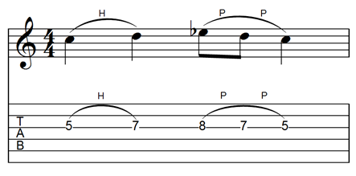

Tablature notation provides a direct guideline to the strings and frets used to play music on a guitar or other fretted instrument, often at the expense of precise rhythmic information. In MusicXML, this rhythmic information needs to be specified, although the display is likely to be hidden on a tab part. The main things that need to be added are the fret and string information, the details of the how the strings are tuned, and techniques specific to guitars and other related instruments.

## Fret and String

Here is a simple [one-measure guitar part example](../../musicxml-reference/examples/tutorial-tablature/) that we will use to illustrate the basic MusicXML tablature features, using the standard 6-string guitar tuning:



The fret and string information needed to generate tablature for guitar and other stringed instruments is handled the same way as technical indications for other instruments, such as piano fingerings and violin bowings. The [`<technical>`](../../musicxml-reference/elements/technical/) element contains these types of notations, and two of its component elements represent the note's [`<fret>`](../../musicxml-reference/elements/fret/) and [`<string>`](../../musicxml-reference/elements/string/). Frets are numbered starting at 0 for the open string. Strings are numbered starting at 1 for the highest string on the instrument.

The fret and string for first note in this example are represented using:

```xml
<technical>
	<string>3</string>
	<fret>5</fret>
</technical>
```

## String Tuning

An [`<attributes>`](../../musicxml-reference/elements/attributes/) element may include a [`<staff-details>`](../../musicxml-reference/elements/staff-details/) element to specify the details of a tab staff. The [`<staff-lines>`](../../musicxml-reference/elements/staff-lines/) element specifies the number of lines on a tablature staff, usually one for each string. Staff tunings are described with the [`<staff-tuning>`](../../musicxml-reference/elements/staff-tuning/) and [`<capo>`](../../musicxml-reference/elements/capo/) elements. TAB is one of the values available for [`<clef>`](../../musicxml-reference/elements/clef/) elements. The print-object attribute of the [`<key>`](../../musicxml-reference/elements/key/) and [`<time>`](../../musicxml-reference/elements/time/) elements is used to indicate that the key and time signatures should not be displayed on this staff.

The tab part in our example begins with the following attributes:
```xml
<attributes>
	<divisions>2</divisions>
	<key print-object="no">
		<fifths>0</fifths>
		<mode>major</mode>
	</key>
	<time print-object="no">
		<beats>4</beats>
		<beat-type>4</beat-type>
	</time>
	<clef>
		<sign>TAB</sign>
		<line>5</line>
	</clef>
	<staff-details>
		<staff-lines>6</staff-lines>
		<staff-tuning line="1">
			<tuning-step>E</tuning-step>
			<tuning-octave>2</tuning-octave>
		</staff-tuning>
		<staff-tuning line="2">
			<tuning-step>A</tuning-step>
			<tuning-octave>2</tuning-octave>
		</staff-tuning>
		<staff-tuning line="3">
			<tuning-step>D</tuning-step>
			<tuning-octave>3</tuning-octave>
		</staff-tuning>
		<staff-tuning line="4">
			<tuning-step>G</tuning-step>
			<tuning-octave>3</tuning-octave>
		</staff-tuning>
		<staff-tuning line="5">
			<tuning-step>B</tuning-step>
			<tuning-octave>3</tuning-octave>
		</staff-tuning>
		<staff-tuning line="6">
			<tuning-step>E</tuning-step>
			<tuning-octave>4</tuning-octave>
		</staff-tuning>
	</staff-details>
</attributes>
```

## Hammer-ons and Pull-offs

Contemporary guitar notation contains many elements idiomatic to the guitar (and specifically the electric guitar). While elements like [`<harmonic>`](../../musicxml-reference/elements/harmonic/) and [`<bend>`](../../musicxml-reference/elements/bend/) have sporadic support in current MusicXML software, the [`<hammer-on>`](../../musicxml-reference/elements/hammer-on/) and [`<pull-off>`](../../musicxml-reference/elements/pull-off/) elements are supported in many applications.

These elements are represented as technical indications that often go together with a notated slur. In the first half of the bar, a single hammer-on goes together with a single slur:

```xml
<note default-x="82">
	<pitch>
		<step>C</step>
		<octave>4</octave>
	</pitch>
	<duration>2</duration>
	<voice>1</voice>
	<type>quarter</type>
	<stem>none</stem>
	<notations>
		<technical>
			<hammer-on number="1" type="start">H</hammer-on>
			<string>3</string>
			<fret>5</fret>
		</technical>
		<slur number="1" placement="above" type="start"/>
	</notations>
</note>
<note default-x="177">
	<pitch>
		<step>D</step>
		<octave>4</octave>
	</pitch>
	<duration>2</duration>
	<voice>1</voice>
	<type>quarter</type>
	<stem>none</stem>
	<notations>
		<technical>
			<string>3</string>
			<fret>7</fret>
			<hammer-on number="1" type="stop"/>
		</technical>
		<slur number="1" type="stop"/>
	</notations>
</note>
```

But in the second half of the bar, a single slur goes together with two pull-offs:

```xml
<note default-x="272">
	<pitch>
		<step>E</step>
		<alter>-1</alter>
		<octave>4</octave>
	</pitch>
	<duration>1</duration>
	<voice>1</voice>
	<type>eighth</type>
	<stem>none</stem>
	<notations>
		<technical>
			<string>3</string>
			<fret>8</fret>
			<pull-off number="1" type="start">P</pull-off>
		</technical>
		<slur number="1" placement="above" type="start"/>
	</notations>
</note>
<note default-x="330">
	<pitch>
		<step>D</step>
		<octave>4</octave>
	</pitch>
	<duration>1</duration>
	<voice>1</voice>
	<type>eighth</type>
	<stem>none</stem>
	<notations>
		<technical>
			<string>3</string>
			<fret>7</fret>
			<pull-off number="1" type="stop"/>
			<pull-off number="1" type="start">P</pull-off>
		</technical>
	</notations>
</note>
<note default-x="389">
	<pitch>
		<step>C</step>
		<octave>4</octave>
	</pitch>
	<duration>2</duration>
	<voice>1</voice>
	<type>quarter</type>
	<stem>none</stem>
	<notations>
		<technical>
			<pull-off number="1" type="stop"/>
			<string>3</string>
			<fret>5</fret>
		</technical>
		<slur number="1" type="stop"/>
	</notations>
</note>
```

Next: [Percussion](../percussion/)